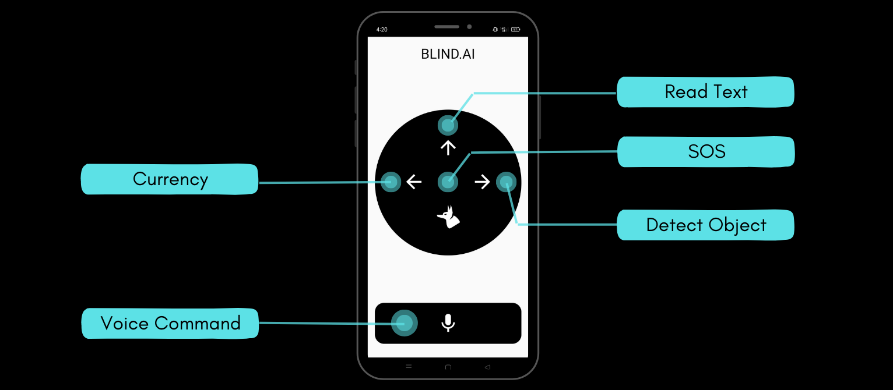
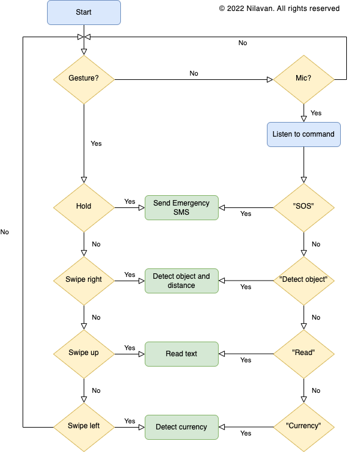

<h1 align="center">
  Seemore <a href="https://github.com/Nilavan/seemore" class="btn btn-outline-success button-round sm" target="_blank"><i class='fab fa-github'></i> </a>
</h1>

An app to make the lives of visually impaired people a little more ordinary.

---

1. [Introduction](#introduction)
2. [Problem Statement](#problem-statement)
3. [Our Solution](#our-solution)
4. [Key Features](#key-features)
5. [Application Workflow](#application-workflow)
6. [Credits](#credits)
7. [Future Work](#future-work)
8. [Contributors](#contributors)
9. [References](#references)
10. [License](#license)

 

## Introduction

The development of tools and technology hasn't resulted in the development of applications that could aid those with visual impairments. With the development of Data Modelling techniques, which can be used to give even basic computers a bit of "intelligence," and the ease of accessibility, this "intelligence" can be extended to our smartphones to aid those who are blind in navigating their surroundings and going about their daily lives. By utilising the power of Deep Learning, which can be made accessible even on low-end devices with a clear User-Interface that would precisely allow them to better grasp the world around, our application seeks to close the gap between them and the visible world.

This app enables the community of blind and visually impaired people to correctly identify objects they come across in everyday life without the need for sighted assistance.

 

## Problem Statement

Vision impairment poses an enormous global financial burden with the annual global costs of productivity losses associated with vision impairment estimated to be US$ 411 billion.
The main challenges faced by blind people include

- Navigating around places
- Finding reading material

 

## Our Solution

A voice and gesture based app to make the lives of visually impaired people a little more ordinary. This app essentially helps in gaining independence without having to rely on external devices that may not be accessible to most people.

All the features are accessible via swipe/hold gestures and voice commands. Simply say "seemore" followed by the feature you want to access to activate. The app uses speech to notify the results to the users.

 

## Key Features

 

#### ⭐️ Voice Commands

 

Press the mic button and use the command "Seemore" to activate. Then, use one of the following commands:

- "SOS"
- "detect object"
- "currency"
- "read text"

to access the corresponding feature.

The app uses the Speech-to-text package in flutter to recognize the user command.

> Implemented by [@Ajith Manivannan](https://github.com/ajith-m-doodlebug)

 

#### ⭐️ SOS - Quickly send alerts to your emergency contacts.

 

Quickly send alerts to your emergency contacts by touch and hold gesture on the center of the app or by using the “SOS” command.

The app uses the Twilio API to send an SMS to emergency contacts to indicate that immediate help is required.

> Implemented by [@N Lirajkhanna](https://github.com/N-liraj-khanna)

 

#### ⭐️ Object Detection - Detects the object in front of you and the distance you are from it.

 

Swipe right or use the command “detect object” to detect the object in front of you and find the distance you are from the object.

- **v1:** The app uses the yolov3-tiny model for object detection which has a tested mean average precision of 33.1 with 220 fps.

- **v2:** The app uses the yolov5s model for object detection. This has resulted in greater improvement in object detection accuracy and speed.

We use simple camera calibration to calculate the distance between the user and the object detected. With the current version of the app, we can detect up to 80 different everyday objects.

> Implemented by [@Nilavan](https://github.com/Nilavan)

 

#### ⭐️ Currency Detection - Detects currency denominations.

 

Swipe left or use the command “currency” to detect currency denominations.

- **v1:** The app uses feature matching from openCV and was trained on limited data due to time constraints.

> Implemented by [@N Lirajkhanna](https://github.com/N-liraj-khanna)

- **v2:** The app uses feature extraction methods from openCV which are used as input to a Machine Learning model, trained on a much larger dataset and optimized to achieve an accuracy of over 90%.

> Implemented by [@Nilavan](https://github.com/Nilavan)

 

#### ⭐️ Read Text - Reads the text for you.

 

Swipe up or use the command “read text” to read the detected text.

This has been implemented using an optical character recognition (OCR) tool that will recognize and read the text embedded in images.

> Implemented by [@TM Vishnu Mukundan](https://github.com/calicartels)

 

## Application Workflow

 

## Credits

This software uses the following open source packages:

- [Flutter](https://flutter.dev/)
- [Python](https://www.python.org/)
- [Python Anywhere](https://www.pythonanywhere.com/)
- [Twilio](https://www.twilio.com/)
- [Flask](https://flask.palletsprojects.com/en/2.2.x/)

 

## Future Work

Although the features we set out to build have been successfully implemented, the following areas can be improved in future versions of the app.

- [x] Accuracy of detection models can be improved. We can use better and more efficient models trained on a wide variety of data to make it more robust.
- [ ] Extend object detection to more classes. The current version of the app can detect up to 80 different everyday objects. Our goal is to extend this to most objects we come across.
- [ ] Implement object detection in real-time instead of capturing image. This can drastically improve the “independence” of the visually impaired. At present, we send an image to the API and it returns the result. Our next goal is to allow the user to simply have the camera open while our app informs the person about objects detected at any time.

 

## Contributors

> - [A Nilavan](https://github.com/Nilavan)
>   - Backend development
>   - Object detection (v1 & v2)
>   - Currency detection (v2)
> - [Ajith Manivannan](https://github.com/ajith-m-doodlebug)
>   - Frontend development
>   - Speech-to-text & text-to-speech
> - [N Lirajkhanna](https://github.com/N-liraj-khanna)
>   - SOS feature
>   - Currency detection (v1)
>   - Backend deployment
> - [TM Vishnu Mukundan](https://github.com/calicartels/)
>   - Text detection (OCR)

 

## References

1. [Detecting Objects in Flutter](https://towardsdatascience.com/detecting-objects-in-flutter-4fe8cfccef14)
2. [Find distance from camera to object/marker using Python and OpenCV](https://pyimagesearch.com/2015/01/19/find-distance-camera-objectmarker-using-python-opencv/)
3. [How to OCR with Tesseract, OpenCV and Python](https://nanonets.com/blog/ocr-with-tesseract/)
4. [How to Send an SMS With Python Using Twilio](https://www.twilio.com/blog/2016/10/how-to-send-an-sms-with-python-using-twilio.html)
5. [Adding speech-to-text and text-to-speech support in a Flutter app](https://blog.logrocket.com/adding-speech-to-text-text-to-speech-support-flutter-app/)

 

## License

This project is licensed under the MIT License - see the [LICENSE.md](https://github.com/Nilavan/seemore/blob/main/LICENSE) file for details

> [nilavan.github.io](https://www.nilavan.github.io) &nbsp;&middot;&nbsp;
> GitHub [@Nilavan](https://github.com/Nilavan) &nbsp;&middot;&nbsp;
