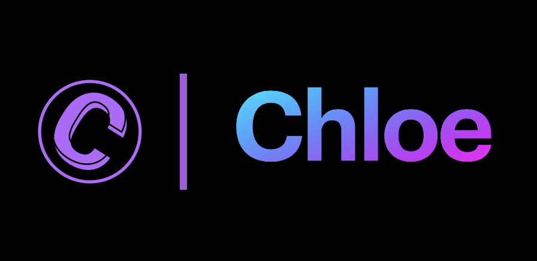

<h1 align="center">

</h1> 

<h2 align="center">
<a href="https://github.com/ajith-m-doodlebug/Chloe" class="btn btn-outline-primary lg" target="_blank"><i class='fab fa-github'></i>&nbsp;Source Code</a>
</h2>
 

> 🌏 Team:
>
> - Ajith Manivannan <a class='fab fa-linkedin' data-toggle='tooltip' data-placement='bottom' data-delay='250' href='https://www.linkedin.com/in/ajith-m-doodlebug/'>
> - A Nilavan

 

Managing personal finances isn’t the easiest thing to do. Sometimes it can feel overwhelming. Small expenses may seem irrelevant at the time but can add up to a great part of your budget. A leading cause of poor money management is due to the lack of financial knowledge. For some strange reason, schools don't teach financial literacy skills. Yet, these are critical for proper financial planning.
  
This easy to use app intends to help solve this problem by keeping track of the user’s expenses. Chloe is an AI powered personal financial assistant residing in the app, designed to help educate the user towards financial independence.

 

|                                                                                               |                                           Prototype                                           |                                                                                               |
| :-------------------------------------------------------------------------------------------: | :-------------------------------------------------------------------------------------------: | :-------------------------------------------------------------------------------------------: |
|  |  |  |
